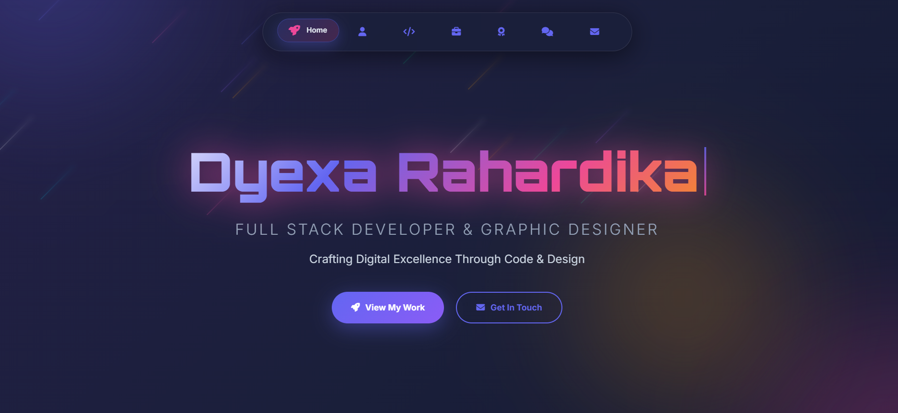

# 🌟 Simple Portfolio 1

A simple yet eye-catching personal portfolio website built using **HTML, CSS, and JavaScript**, focused on clean design, smooth interactions, and modern visual aesthetics.



---

## ✨ About the Project

**simple-portofolio-1** is a lightweight personal portfolio designed to showcase identity, skills, and creativity through a visually engaging interface. This project emphasizes strong UI presentation, subtle animations, and responsive layout without relying on heavy frameworks.

It is built as a foundation project that can be continuously enhanced while maintaining performance and simplicity.

---

## 🚀 Features

- 🎨 Modern and futuristic UI design
- 🌈 Gradient typography and glowing effects
- 🧭 Floating navigation bar
- 📱 Fully responsive layout
- ✨ Smooth transitions and animations
- ⚡ Lightweight and fast load time
- 🧩 Built with pure HTML, CSS, and JavaScript

---

## 🛠️ Tech Stack

- **HTML** – Semantic and structured markup  
- **CSS** – Custom styling, gradients, and animations  
- **JavaScript** – Interactivity and dynamic behavior  

No frameworks. Just core web fundamentals.

---

## 📂 Project Structure

```

site/
├── index.html
├── style.css
├── script.js

```

---

## 🌐 Live Preview

🔗 https://dyexadev.edgeone.app

---

## 📌 Goals

- Strengthen HTML, CSS, and JavaScript fundamentals  
- Practice modern UI/UX concepts  
- Build a visually appealing personal website  
- Serve as a base for future portfolio improvements  

---

## 📄 License

This project is open-source and available under the **MIT License**.

---

## 👤 Author

**Dyexa Rahardika**  
Full Stack Developer & Graphic Designer  

⭐ If you like this project, feel free to star the repository!
